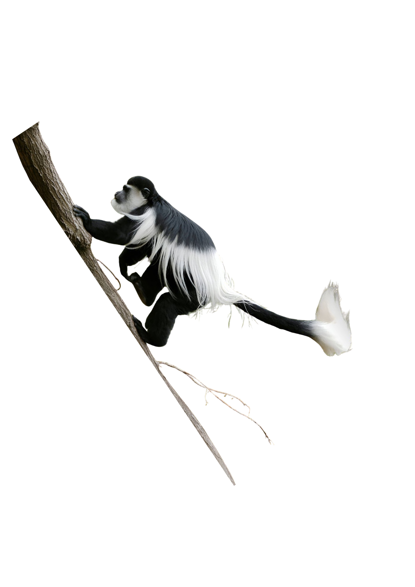
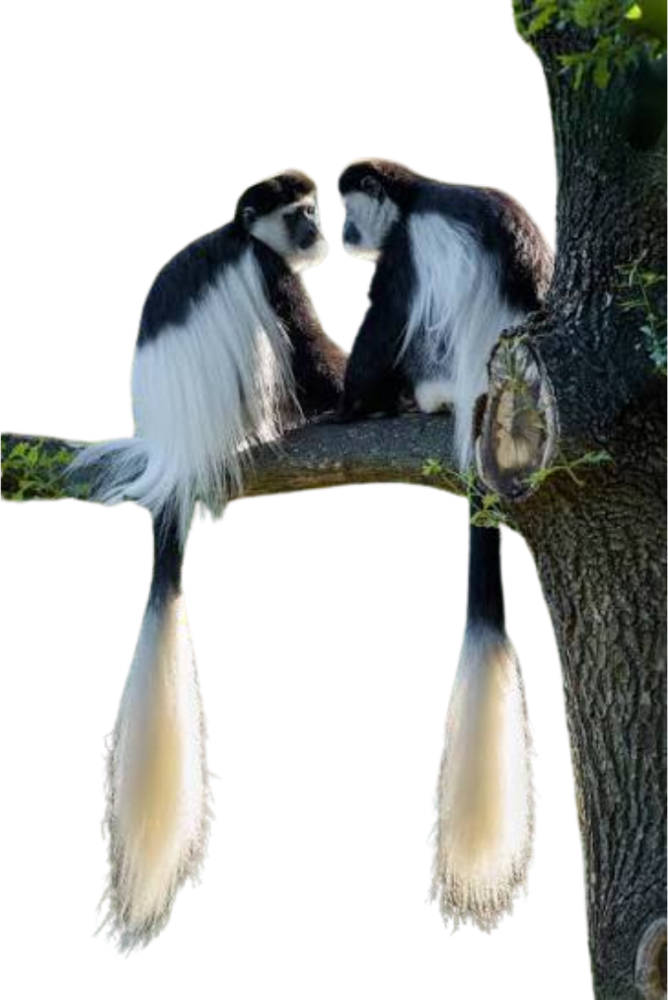
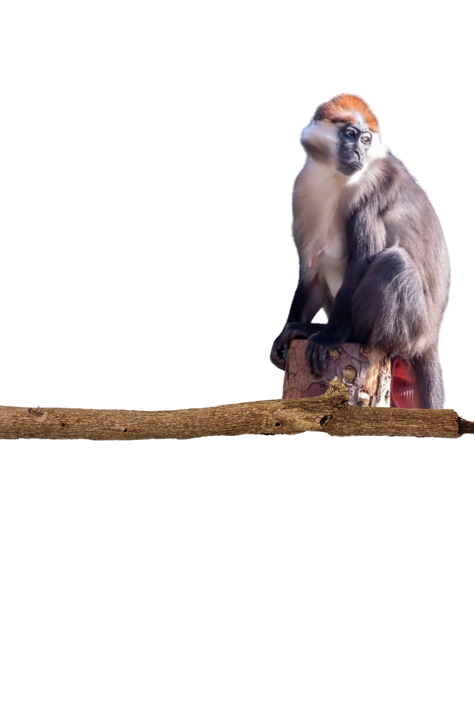

# Exploring Mangabeys
Hello! If you enjoy off-the-beaten-path trips with a good dose of nature and respectful local life discovery, the info on this page is going to be very useful!

The trips we are sharing are itineraries we pieced together through a lot of reddit and research. Please do not hesitate to get in touch via the comments if you have any questions and happy travelling!

!!! danger "Here is a map of the current countries we have blogs for:"

## Our view on our travels
Travelling comes with privilege. We travel with our money, education, cultural and social understandings and norms. When we leave the "beaten path" and choose to travel further away from the established tourist trail through countries, we end up in places where economies and social structures are not necessarily prepared to receive us. It is important in those moments to remember that we are guests and to respect the values, norms and traditions of the place we are in. We are also a guest of nature and must leave no trace wherever we go. We have tried as much as possible to abide by this wherever we have gone and hope that wandering through these places you will too. Being kind and open-minded goes a long way!

{ .side-animal .side-left .side-mid loading=lazy style="width:11rem; top:2rem; left:-9rem"}
{ .side-animal .side-right .side-mid loading=lazy style="top:-2rem;width:10rem" }
{ .side-animal .side-left .side-mid loading=lazy style="width:20rem; top:19.3rem; left:-8rem"}
